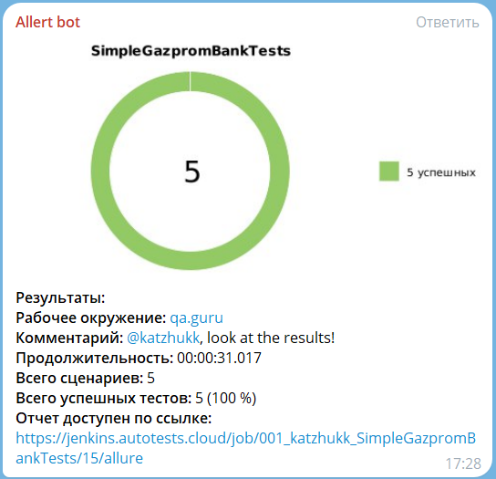

# Тесты для сайта [Газпромбанка](https://www.gazprombank.ru/)
<p align="center">  
<a href="https://www.gazprombank.ru/"> 
</p>  

---
## Содержание

* [Технологии и инструменты](#Технологии-и-инструменты)
* [Список проверок](#Список-проверок)
* [Сборка в Jenkins](#Сборка-в-Jenkins)
* [Allure Report](#Allure-report)
* [Уведомление в Telegram о результатах тестов](#Уведомление-в-Telegram-о-результатах-тестов)
* [Видео прохождение тестов](#Видео-прохождение-тестов)

---
## <a name="Технологии-и-инструменты:">**Технологии и инструменты:**</a>

<p align="center">  
<a href="https://www.jetbrains.com/idea/"></a>  
<a href="https://www.java.com/"></a>  
<a href="https://github.com/"></a>  
<a href="https://junit.org/junit5/"></a>  
<a href="https://gradle.org/"></a>  
<a href="https://selenide.org/"></a>  
<a href="ht[images](images)tps://github.com/allure-framework/allure2"></a>  
<a href="https://www.jenkins.io/"></a>  
<a href="https://aerokube.com/selenoid/"></a>  
<a href="https://web.telegram.org/k/"></a>  
</p>

---
<a id="tests"></a>
## <a name="Список-проверок">**Список проверок**</a>

* Проверка на выбор города на главной странице Газпромбанка  
* Проверка результата поиска по запросу Вклад
* Проверка на клибакельность кнопки Стать клиентом
* Проверка на открытие карты с офисами Газпромбанка
* Проверка на открытие карты с банкоматами Газпромбанка

---

<a id="tools"></a>
## <a name="Сборка-в-Jenkins">**Сборка в Jenkins**</a>

Тесты запускаются через [Jenkins](https://jenkins.autotests.cloud/job/001_katzhukk_SimpleGazpromBankTests/)


Для запуска тестов необходимо нажать на кнопку "Build with Parameters". Появится прогресс бар с номером сборки тестов.

---
## Команды для запуска из терминала

Удалённый запуск через Jenkins:
```bash 
clean 
SimpleGazpromBankTests
-Dbrowser=${BROWSER}
-DbrowserVersion=${BROWSER_VERSION}
-DbrowserSize=${BROWSER_SIZE}
-DurlHost=${WDHOST}
```
---

<a id="allure"></a>
## <a name="Allure-report">**Allure Report**</a>

После окончания прогона тестов формируется отчет [Allure](https://jenkins.autotests.cloud/job/001_katzhukk_SimpleGazpromBankTests/15/allure/)


## Основная страница отчёта

<p align="center">  
  
</p> 

---
## Тест-кейсы

Содержат подробное описание шагов со скриншотами, видео и Page Source по каждому тесту  

При нажатии на определенный тест, раскрываются шаги теста с приложенными вложениями
<p align="center">  
  
</p>

---

## <a name="Уведомление-в-Telegram-о-результатах-тестов">**Уведомление в Telegram о результатах тестов**</a>

Telegram бот уведомляет о результатах тестах для быстрой визуализации отчетности
<p align="center">  
  
</p> 

____

## <a name="Видео-прохождения-тестов">**Видео прохождения тестов**</a>

<p align="center">
   
</p>
